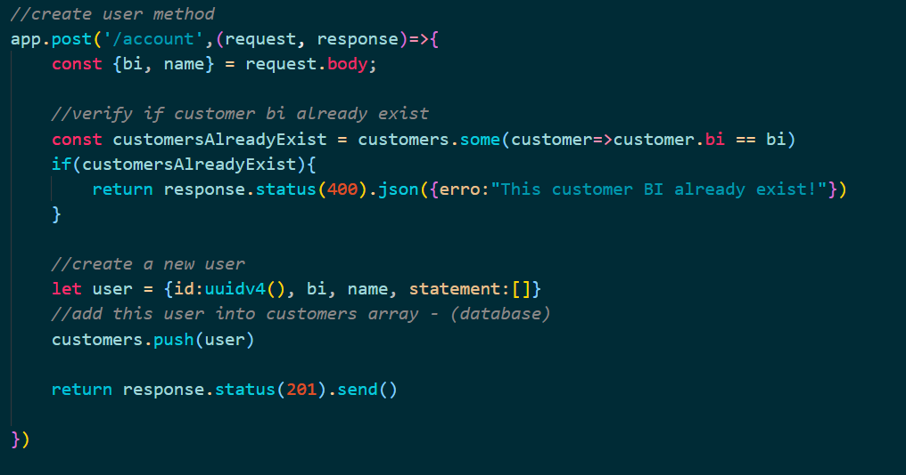
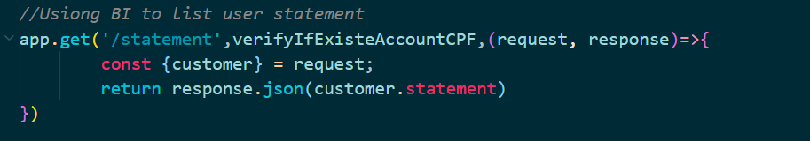

# FinAPI  - Financeira

> É uma APi que contem rotas com as principais funções bancárias. Utilizei um array para fazer o armazenamento dos dados não de forma permanente, utilizando também os conceitos básico de uma API e dos  **middlewares**. 

### Requisitos
- [x] Deve ser possível criar uma conta
- [x] Deve ser possível buscar o extrato bancário de cliente
- [x] Deve ser possível realizar um depósito
- [x] Deve ser possível fazer o levantamento
- [x] Deve ser possível buscar o extrato bancário do cliente por data
- [x] Deve ser possível actualizar dados da conta do cliente
- [x] Dever ser possível deletar uma conta

## Regras de negócio

- [x] Não deve ser possível cadastrar uma conta com BI já existete
- [x] Não deve ser possível fazer depósito em uma conta não existente
- [x] Não deve ser possível buscar extrato de uma conta não existente
- [x] Não deve ser possível fazer lrvantamento de uma conta não existente
- [x] Não deve ser possível excluir uma conta não existente
- [x] Não deve ser possível fazer levantamento quando o saldo for insuficiente

#### Algumas funcionalidades 

_Middleware - **verifyIfExisteAccountCPF**_
> Este é o middleware simula a autenticação durante uma requisição, ele verfica o número do BI que vem no header da requisição, caso o BI não existir ou se o array que armazena os dados estiver vezio retornará erro com código 400 caso exista a aplicação procesuirá.

*Fig-1: imagem middleware* 

_Account_
> Esta é a route para cadastrar os customers (clientes) 

*Fig-2: routa para criar customers* 

_Statement_
> Esta é a route permite retorna os estrato bancário do user, mas antes de retornar o user e verificado no nosso middleware só assim que o extrato bancário é retornado 

*Fig-2: routa para consultar extratos bancário* 

### Nota

_Exitem mais rotas e métodos, para compreenderes melhor analise o arquivo index.js_

###ESTOU ABERTO PARA QUALQUER FEEDBACK

